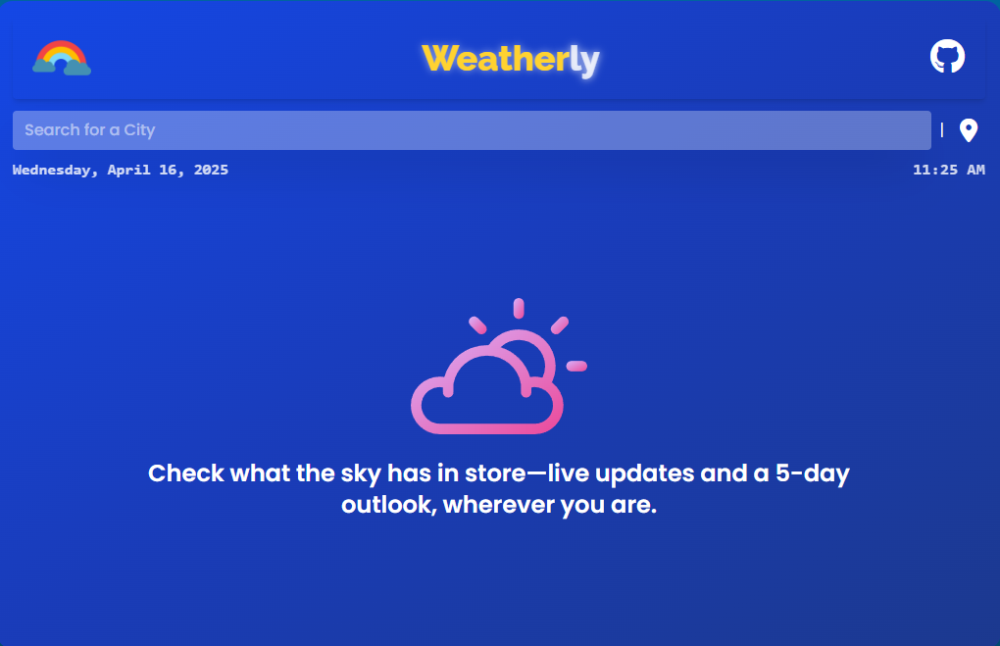
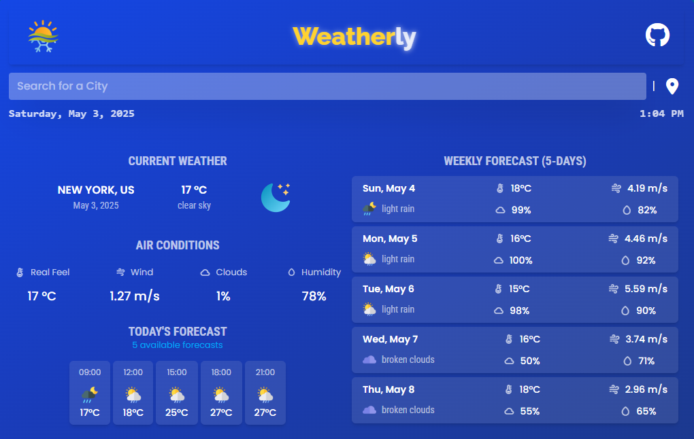

<h1 align="center">Weatherly</h1>

<p align="center">
  
</p>

**Weatherly** is a user-friendly weather forecast application that delivers both elegance and utility in one interface with a vibrant yet subtle design.  
It offers real-time weather updates, air conditions, and a 5-day forecast — all neatly wrapped in a responsive layout.

The app is built using **HTML**, **Tailwind CSS** (via CLI), and **Vanilla JavaScript**.

<br>

## Live Demo

You can view a live demo of **Weatherly** at [click here](https://weatherly-project.netlify.app/).  
Try it directly in your browser to see the weather forecast in action!

[](https://app.netlify.com/sites/weatherly-project/deploys)

<br>

## Built With

- **Frontend**: HTML5, [Tailwind CSS](https://tailwindcss.com/), Vanilla JavaScript

### APIs:
- [OpenWeatherMap Current](https://openweathermap.org/current)
- [5-Day Forecast](https://openweathermap.org/forecast5)
- [Geocoding API](https://openweathermap.org/api/geocoding-api)

### Resources:
- **Icons**: [FontAwesome](https://fontawesome.com/), [BoxIcons](https://boxicons.com/)
- **Images/GIFs**: [FlatIcons](https://www.flaticon.com/), [Loading.io](https://loading.io/)  

<br>

## Features

- ☁️ Current Weather & Air Conditions.
- 🌍 Geolocation-based Weather.
- 📅 5-Day Forecast with Daily Breakdown.
- 📱 Responsive Design for iPhone SE, iPad Mini & Desktop.
- ⚠️ Error Handling with user-friendly messages.
- 📋 Recent Searches (stored locally).
- ⏱️ Live Clock (Date & Time).

<br>

## Usage

- Search for any city to get current weather, air conditions, and a 5-day forecast.
- Click the 📍 icon to get weather for your current location.
- Your recent searches will appear below the input field for easy re-access.
- Works across devices — desktop, tablet, and mobile.
- If the app fails to fetch weather data, it will display an error message.
- Invalid city names or unsupported locations will prompt a helpful error message.

<br>

## Setup Instructions

#### Prerequisites
- A modern web-browser.
- A OpenWeatherMap's API Key.
- [`Node.js`](https://nodejs.org/en/download) installed locally (npm is included with Node.js).

#### Clone the project:

```bash
git clone https://github.com/mdfaizan0/weatherly.git
```

#### Go to the project directory:

```bash
cd weatherly
```

#### Install dependencies:

```bash
npm install
```

#### Run Tailwind CSS:

```bash
npm run dev
```

> ⚠️ Note: `src/output.css` is auto-generated from Tailwind’s CLI build. Avoid manual changes — modify `input.css` instead.

#### Replace API Key

```javascript
const API = {
    URL: "https://api.openweathermap.org/data/2.5",
    KEY: OWM_API_KEY_HERE
}
```
- Replace `OWM_API_KEY_HERE` with your OWM's API Key, make sure the API Key is in double quotes ("").
- If you're working in a **public repository** or want to keep your API key secure:
  * Create `config.js` inside the `src/` directory.
  * Add `const OWM_API_KEY_HERE = "your_api_here";` in `config.js`.
  * Replace `your_api_here` with your OWM's API Key.
  * Make sure to add `config.js` to `.gitignore` to keep it secure.


#### Run Project

- Open `src/index.html` directly in your code editor.
- For a smoother experience, use a local server like **Live Server** (Ritwick Dey) or **Live Preview** (Microsoft Extension for VS Code) for smoother routing and real-time preview.

<br>

## Screenshots

### *Pre-Search*
*Shows the layout before the user has entered a city or location.*
<p align="center">
  
</p>

### *Post-Search*
*Shows the layout after the user has searched for a city or location.*
<p align="center">
  
</p>


<br>

## Folder Structure

```bash
.
└── weatherly/
    ├── assets/
    │   ├── icons/
    │   │   └── (18 weather-based icons and 3 more for errors and prompts)
    │   ├── favicon.ico
    │   ├── github-logo.svg
    │   ├── post-search.png
    │   ├── pre-search.png
    │   ├── radio-icon.svg
    │   ├── weather-hero.svg
    │   └── weather-logo.png
    ├── node_modules/ (automatically generated through npm install)
    ├── src/
    │   ├── index.html
    │   ├── input.css
    │   ├── output.css (automatically generated through npm install)
    │   └── script.js
    ├── .gitignore
    ├── package.json
    ├── package-lock.json
    └── README.md
```

<br>

## Acknowledgements

- Design inspiration taken from [aminawinti's The Weather Forecasting App](https://github.com/aminawinti/the-weather-forecasting).

> This project is built for academic and learning purposes only.

Thank You 💚